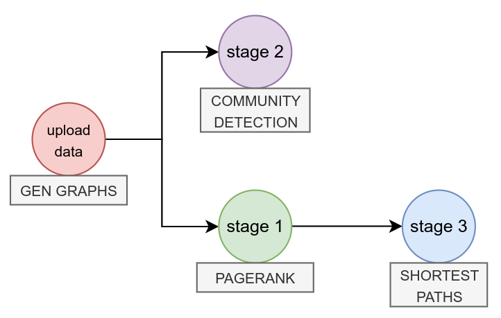

# Lithops fork for compute intensive pipelines

This repository contains the code for the fork of Lithops that is used to run a compute-intensive pipeline (graph
analytics application) over AWS EC2 spot instances.

The purpose of this ad-hoc fork is to compare the performance of the AWS-provided spots allocations strategies against a
the KMU oracle, with is capable of recommending the best spots in terms of power-price ratio (performance).

> ⚠️ **Important note**: This fork is an ad-hoc version of Lithops whose purpose is to run a specific experiment and
> compare the performance of different spot allocation strategies.
>
> Please follow carefully the instructions below to run the experiment, not attending to the general Lithops
> documentation.
>
> If you find any issue or have any question, please contact the owner of this repository.

## The compute-intensive app: Graph Analytics

The compute-intensive application that we are running is a graph analytics application that computes some popular
algorithms of a graph. The graph operations usually involve a lot of computation (cpu-bound stages) and are very
suitable for demonstrating the advantages of power-price spots optimization.

The pipeline perform the following operations (see image):



- The first step is to persist random graphs in object storage (**S3**).
- Then, two parallel stages are launched:
    - **PageRank** calculation: order the nodes of the graph by their importance.
    - **Community detection**: identify the communities of the graph.
- Finally, after the PageRank return is ready, the pipeline computes the **shortest paths** between different nodes in
  the graph.

The pipeline is customizable via constants: in this way, we can tune execution times, parallelism degree, experiment
scale... (please see [`examples/graph_analytics.py`](./examples/graph_analytics.py))
We can also consider in the future to add/modify the stages of the pipeline, for getting different behaviors if necessary.

For the moment, is provided a first setup for the experiment, but it can be easily modified.

- Number of graphs: variable (define depending on the fleet size desired)
- Number of nodes per graph: 5000
- Edge probability: 0.5
- Number of shortest paths to compute: 150

And for these values, the execution info is:

- PageRank: approx 10 seconds cpu-bound time; low RAM usage
- Community detection: approx 5-10 minutes cpu-bound time; nearly 3GB RAM usage
- Shortest paths: approx 5-10 minutes cpu-bound time
- Memory per worker: ensure at least 4GB
- Download time: only a few seconds
- Graph size: 77MB/graph
  
## Executing the experiment

Please, for executing the pipeline, follow the next steps carefully:

1. Clone this repository.
2. Ensure that you are using Python 3.10.
3. Install this Lithops fork:
    ```bash
    pip install .
    ```
4. Setup AWS resources: follow
   the [Installation Lithops section](https://lithops-cloud.github.io/docs/source/compute_config/aws_ec2.html#installation),
   creating required entities (until get an usable IAM instance profile) in AWS.
5. Store this configuration in `~/.lithops/config`:
    ```yaml
    lithops:
        backend: aws_ec2
        storage: aws_s3
        log_level: DEBUG
    
    aws:
        access_key_id: ...
        secret_access_key: ...
        session_token: ...
        region: us-east-1
    
    aws_ec2:
        instance_role: ...
        exec_mode: reuse
        runtime_memory: 4096
        soft_dismantle_timeout: 30
        target_ami: ami-0f4fa9094598e07a2
        allocation_strategy: ...
    ```
6. Fill/replace the values in the configuration. We provide the explanation of the fields here:
    - `access_key_id`, `secret_access_key`, `session_token`: AWS credentials.
    - `instance_role`: the **IAM instance profile** that the instances will assume.
    - `allocation_strategy`: the strategy to use for spot allocation. Options: AWS strategies (`lowest-price`,
      `capacity-optimized`,
      `capacity-optimized-prioritized`,
      `diversified`,
      `price-capacity-optimized`) or KMU policies (`kmu-ppcp`, `kmu-ppf`)
    - `target_ami`: Don't change this value. We provide a public custom AMI with the required dependencies.
    - `runtime_memory` (MB): Ensure that the memory is enough for the pipeline. OOM errors can occur, and then the pipeline stuck with no error message.
    - `soft_dismantle_timeout` (s): The time to kill the spot instances after no activity periods.
7. Enter `examples/graph_analytics.py` (modify constants if necessary) and check that all is defined as expected. 
8. Run the pipeline:
    ```bash
    python3 examples/graph_analytics.py
    ```
    The pipeline will start, and you will see the logs (`DEBUG` level for more info) of the execution.

## Collecting the data
Lithops Futures API has a new ad-hoc method for collecting the data of the executions. This method is called `dump_stats_to_csv` and its purpose is to collect the data of the executions and store it in CSV format.

For the moment, the collected data for each experiment is wrapped in a folder with the name of the experiment. Inside, you will find CSV files.

```angular2html
experiment-no1/
    stats.csv
    vms.csv
```

Inspect the CSV columns for getting the full information of the data collected.

#### Plotting the execution
You still can use the `plot` function for plotting the executions. This generate the default Lithops plots [info here](https://lithops-cloud.github.io/docs/source/api_stats.html#execution-summary-plots)

But is preferable to collect all the metrics (CSV files above), and then plot them with a custom script.


## Eviction management
> ❌ Since the execution times are short, and the main objective of the experiment is to measure the power-price performance of the different policies, eviction management is not yet implemented.
> 
> If it is required for some experimentation requirements, please contact the repository owner for implementing it.


